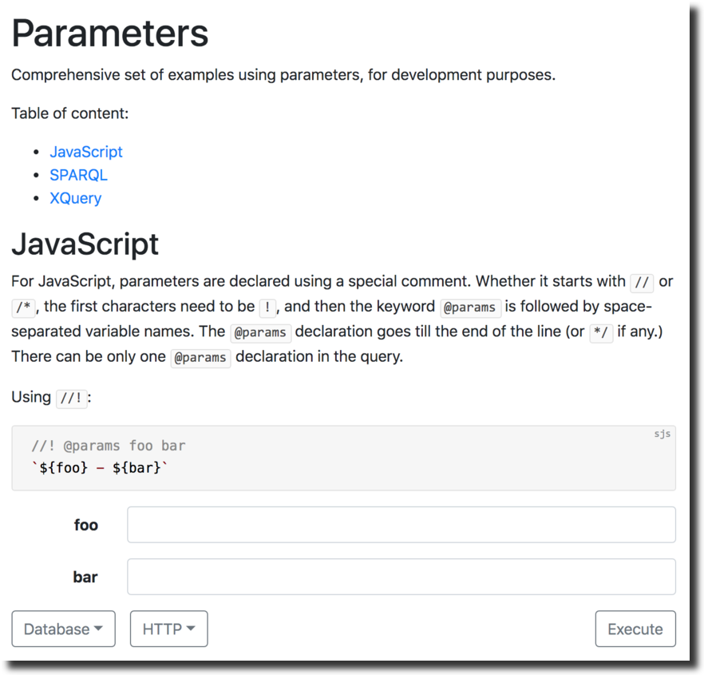

# Qbook introduction

♥ - **Use Markdown and its flexibility to organize, save and share the code you evaluate
on MarkLogic.**

A query book, or qbook for short, is a simple Markdown file, that contains JavaScript or
XQuery code.  When rendered in the ML Console, the code is attached with buttons for
evaluation on MarkLogic.

You can select the target content database.  If the code imports any module, you can
rather select an application server (its content and modules databases will then be used
for evaluating the code.)

The result of evaluating the code is displayed in the result pane.

The form to evaluate the code will display fields to enter parameter values.

## Create a qbook

Creating a qbook it easy: just create any Markdown file.  The code you want to evaluate
must be marked with the usual `` ``` `` syntax.  You just need to make sure you mark it
with the language `javascript` or `xquery`:

~~~no-highlight
```xqy
fn:string-join(('Hello', 'world!'), ', ')
```
~~~

## Display a qbook

A qbook must be part of a project to be displayed.  In the ML Console, just go to
`Projects` in the menu bar.  Add an `mlproj` project.  Make sure you provide a directory
on the same machine as where MarkLogic is running (e.g. your own machine if you run
MarkLogic on `localhost`.)

When you display the `Projects` page again, the table with the list of all projects
contains a column `Info`, with a link to the project directory.  You can then browse
directories to your qbook.

## Try it now

The ML Console code base contains a few qbooks.  So in the `Projects` page, go to add a
new `mlproj` project.  Enter the path to the directory where you cloned the ML Console
repository, and click on `Add`.

On the `Project` page, on the table at the top, click on the link to the project
directory.  The qbooks are in `test/qbooks/`.

- `sample-large.md` - various examples
- `dev-params.md` - comprehensive examples for declaring parameters

Screenshot of a qbook:



## Participate

Issues, ideas, insults and other contributions are welcome as new issue tickets on
[GitHub](https://github.com/fgeorges/expath-ml-console).
